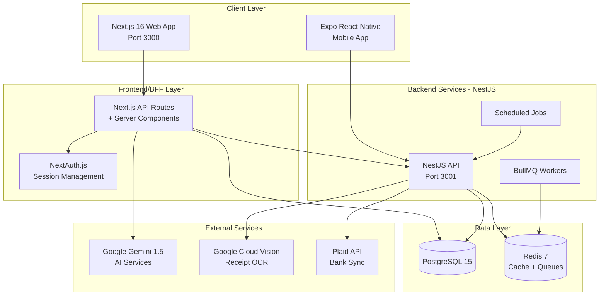
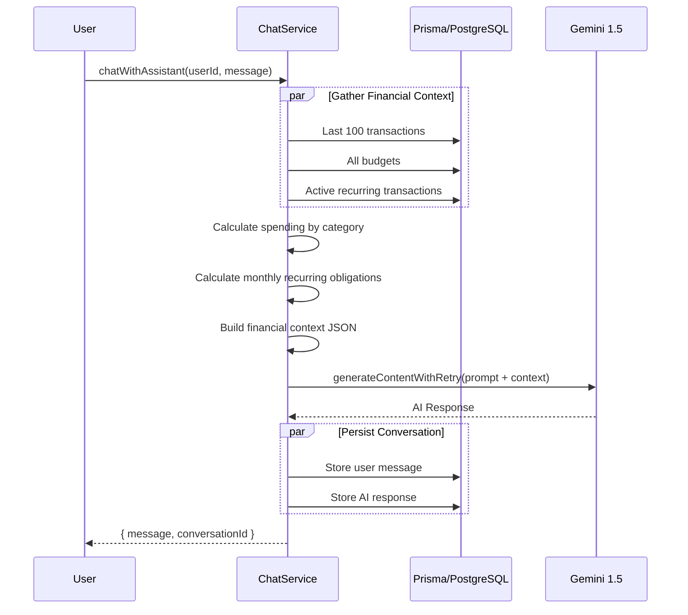
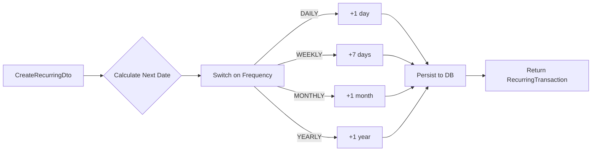
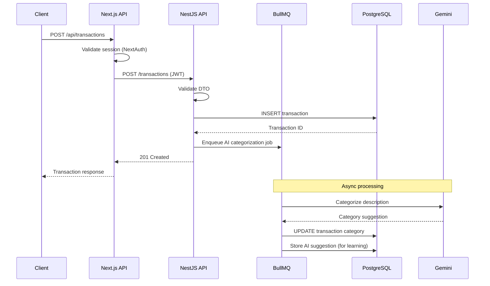

# 🏗️ FinanceFlow Architecture Deep Dive

> **For:** Senior Engineers onboarding to the codebase  
> **Date:** December 2025  

---

## Table of Contents
1. [High-Level Architecture Overview](#high-level-architecture-overview)
2. [Module Responsibilities](#module-responsibilities)
3. [Service Deep Dives](#service-deep-dives)
4. [Execution Flow Traces](#execution-flow-traces)
5. [Design Patterns & Interview Points](#design-patterns--interview-points)

---

## High-Level Architecture Overview



### Architecture Pattern: **Hybrid BFF + Microservice**

| Layer | Technology | Responsibility |
|-------|------------|----------------|
| **Web Frontend** | Next.js 16 (App Router) | UI, SSR, direct database reads for fast rendering |
| **Backend-for-Frontend** | Next.js API Routes | Authentication, AI chat, real-time features |
| **Service Layer** | NestJS | Heavy processing, background jobs, external integrations |
| **Queue System** | BullMQ + Redis | Async job processing, rate-limited operations |
| **Persistence** | PostgreSQL + Prisma | Single source of truth, shared schema |

> [!IMPORTANT]
> Both Next.js and NestJS share the same Prisma schema. This is intentional for read-heavy operations (Next.js reads directly) vs write-heavy/async operations (routed to NestJS).

---

## Module Responsibilities

### Frontend (`/src`)

```
/src
├── app/           → Next.js 16 App Router pages & API routes
├── components/    → 117 reusable React components (Shadcn/ui based)
├── lib/
│   ├── ai/        → 10 AI services (chat, forecast, categorization, OCR)
│   ├── services/  → 9 business services (notifications, currency, reports)
│   └── ...        → Utils, validators, rate limiters
├── hooks/         → 12 custom React hooks
└── providers/     → Context providers (SWR, Auth)
```

#### Key Frontend Modules

| Module | Responsibility | NOT Its Responsibility |
|--------|----------------|------------------------|
| `lib/ai/chat-service.ts` | AI assistant conversations with financial context | Receipt scanning (delegated to backend) |
| `lib/ai/forecast-service.ts` | 3-month spending predictions, trend analysis | Real-time budget enforcement |
| `lib/services/notification-service.ts` | In-app notifications, budget alerts | Email sending (uses external service) |
| `lib/services/plaid-service.ts` | Bank account linking, transaction sync | Transaction categorization |

### Backend (`/backend/src`)

```
/backend/src
├── modules/
│   ├── auth/          → JWT authentication, guards
│   ├── transactions/  → CRUD, stats, bulk ops, CSV export
│   ├── budgets/       → Budget management, overage detection
│   ├── recurring/     → Subscription tracking, next-date calculation
│   ├── goals/         → Savings goals, milestones
│   ├── ai/            → Receipt OCR, ML categorization
│   ├── analytics/     → Aggregations, reports
│   ├── notifications/ → Push notifications, email triggers
│   ├── currency/      → Multi-currency support
│   ├── integrations/  → Plaid, external APIs
│   └── jobs/          → BullMQ job processors
├── common/            → Guards, interceptors, decorators
└── database/          → Prisma service wrapper
```

#### Key Backend Modules

| Module | Responsibility | NOT Its Responsibility |
|--------|----------------|------------------------|
| `transactions` | Full transaction lifecycle, pagination, soft-delete | AI categorization (delegated to ai module) |
| `recurring` | Subscription management, frequency calculations | Actually generating transactions (job module) |
| `budgets` | Budget CRUD, overage calculation | Sending alerts (notification module) |
| `jobs` | Background processing, queue management | Business logic (calls service modules) |

---

## Service Deep Dives

### 1. AI Chat Service (`/src/lib/ai/chat-service.ts`)

#### Contract

| Input | Type | Description |
|-------|------|-------------|
| `userId` | `string` | Authenticated user ID |
| `message` | `string` | User's chat message |
| `conversationHistory` | `ChatMessage[]` | Optional prior context |

| Output | Type | Description |
|--------|------|-------------|
| `message` | `string` | AI response |
| `conversationId` | `string` | UUID for conversation tracking |

#### Execution Flow



**Design Rationale:**
- **Parallel DB queries**: 3 queries fire simultaneously to minimize latency
- **Context injection**: User's actual financial data injected into prompt for personalized responses
- **Conversation persistence**: All exchanges stored for audit trail and continuity
- **Retry handler**: External AI calls wrapped in exponential backoff

**Edge Cases & Safeguards:**
- AI API failure fallback returns a graceful error message, not an exception
- Conversation ID generated server-side (UUID) to prevent ID prediction attacks
- Financial data is summarized, not raw, to stay within token limits

---

### 2. Transactions Service (`/backend/src/modules/transactions/transactions.service.ts`)

#### Contract

| Method | Input | Output |
|--------|-------|--------|
| `create` | `userId`, `CreateTransactionDto` | Serialized transaction |
| `findAll` | `userId`, `QueryTransactionDto` | `PaginatedResponse<Transaction>` |
| `update` | `userId`, `id`, `UpdateTransactionDto` | Updated transaction |
| `softDelete` | `userId`, `id` | Success message |
| `getStats` | `userId`, `dateRange?` | Income/expense breakdown |
| `bulkCreate` | `userId`, `transactions[]` | Count confirmation |
| `exportToCsv` | `userId`, `query` | CSV file content |

#### Execution Flow for `findAll`

1. **Input Validation**: DTO validated by class-validator decorators
2. **Pagination Capping**: Limit enforced to max 100 (prevents abuse)
3. **Dynamic Where Clause**: Builds Prisma filter from query params
4. **Parallel Execution**: Data fetch + count run simultaneously
5. **Serialization**: Decimal → Number, Date → ISO string conversion
6. **Paginated Response**: Returns `{ data, meta: { total, page, totalPages } }`

**Design Rationale:**
- **Soft delete pattern**: `deletedAt` field preserves data for auditing
- **Repository layer**: Service delegates to repository, enabling easy mocking
- **Decimal handling**: Prisma Decimal converted to Number only at serialization boundary
- **CSV injection prevention**: All exported cells sanitized against formula injection

**Risk & Safeguards:**
- Bulk operations capped at 1000 to prevent memory exhaustion
- All queries include `userId` filter (multi-tenant isolation)
- Search uses case-insensitive `contains` (PostgreSQL `ILIKE`)

---

### 3. Recurring Service (`/backend/src/modules/recurring/recurring.service.ts`)

#### Contract

| Method | Description |
|--------|-------------|
| `create` | Create recurring transaction with calculated `nextDate` |
| `skipNext` | Advance `nextDate` by one frequency period |
| `calculateNextDate` | Pure function: Date + Frequency → Next Date |

#### Execution Flow for `create`



**Design Rationale:**
- **Pre-calculated `nextDate`**: Enables efficient querying for due items without runtime calculation
- **Encapsulated frequency logic**: `calculateNextDate` is reusable for skip operations
- **No ORM leakage**: Amount converted to Prisma Decimal at service boundary

**Edge Cases:**
- Month-end edge case: Adding 1 month to Jan 31 yields Feb 28/29 (JavaScript Date handles this)
- Unknown frequency throws explicit error rather than silent failure

---

### 4. Forecast Service (`/src/lib/ai/forecast-service.ts`)

#### Contract

| Input | Description |
|-------|-------------|
| `transactions[]` | Historical transactions for pattern analysis |
| `recurringTransactions[]` | Fixed obligations for baseline |
| `months` | Number of months to forecast (typically 3) |
| `userId` | For logging and potential personalization |

| Output | Description |
|--------|-------------|
| `months[]` | Array of monthly forecasts with category breakdowns |
| `confidence` | 0-1 score based on data quality |
| `insights[]` | AI-generated actionable recommendations |

#### Execution Flow

1. **Historical Analysis**: Calculate category averages from transaction history
2. **Trend Detection**: Compare recent vs older spending to identify direction
3. **Recurring Baseline**: Convert frequencies to monthly equivalents
4. **AI Enhancement**: Gemini adds seasonal patterns and anomaly detection
5. **Confidence Scoring**: Lower with less historical data

**Design Rationale:**
- **Hybrid approach**: Statistical base + AI enhancement = both explainable and intelligent
- **Lazy initialization**: Gemini client only instantiated on first use (prevents build-time failures)
- **Confidence intervals**: Honest about prediction uncertainty

---

## Execution Flow Traces

### Feature: "Create Transaction with AI Categorization"



**Layer Responsibilities:**
| Layer | Owns | Side Effects |
|-------|------|--------------|
| Next.js API | Authentication, request forwarding | Session validation |
| NestJS API | Business validation, persistence | Database write |
| BullMQ | Async AI processing | Category update, suggestion storage |

**Transactions & Queues:**
- Database write is synchronous (user gets immediate feedback)
- AI categorization is async (doesn't block response)
- Queue job is idempotent (can safely retry on failure)

---

## Design Patterns & Interview Points

### 1. Repository Pattern (Backend)

**Why enterprise-grade:**
- Services contain business logic, repositories handle data access
- Easy to swap database (theoretically) or add caching layer
- Unit tests mock repository, not Prisma

**Trade-offs:**
- Additional abstraction layer (more files)
- Tight coupling to Prisma types in practice

### 2. BFF (Backend-for-Frontend) Pattern

**Problem solved:**
- Mobile and web have different data needs
- Authentication handled at edge (Next.js)
- Reduces client-side complexity

**Trade-offs:**
- Two services touching same database
- Schema changes require coordinated deploys

### 3. Soft Delete Pattern

**Problem solved:**
- Audit trail for financial data
- User "undo" capability
- Regulatory compliance

**Trade-offs:**
- All queries must filter `deletedAt: null`
- Index bloat over time

### 4. Context-Aware AI

**Problem solved:**
- Generic AI knows nothing about user's finances
- Personalized advice based on actual spending patterns

**Trade-offs:**
- Token cost scales with context size
- Privacy considerations (data sent to AI)

---

## Interview Talking Points

> 3 things you can confidently say about this architecture:

1. **"We use a hybrid BFF pattern where Next.js handles authentication and read-heavy operations directly, while NestJS processes async jobs and complex business logic. This gives us SSR speed without sacrificing background processing capability."**

2. **"AI features are context-injected—the chat assistant receives summarized financial data (spending by category, recurring obligations, recent transactions) so responses are personalized without exposing raw records. We use exponential backoff on AI calls to handle rate limits gracefully."**

3. **"Multi-tenancy is enforced at the service layer—every query includes a `userId` filter. Combined with soft-delete, we maintain a complete audit trail while supporting regulatory requirements for financial data retention."**

---

## Key Files Reference

| Domain | Critical Files |
|--------|---------------|
| **AI Chat** | [chat-service.ts](file:///Users/step/Documents/finance-flow-project/src/lib/ai/chat-service.ts), [gemini-client.ts](file:///Users/step/Documents/finance-flow-project/src/lib/ai/gemini-client.ts) |
| **Forecasting** | [forecast-service.ts](file:///Users/step/Documents/finance-flow-project/src/lib/ai/forecast-service.ts) |
| **Transactions** | [transactions.service.ts](file:///Users/step/Documents/finance-flow-project/backend/src/modules/transactions/transactions.service.ts) |
| **Recurring** | [recurring.service.ts](file:///Users/step/Documents/finance-flow-project/backend/src/modules/recurring/recurring.service.ts) |
| **Notifications** | [notification-service.ts](file:///Users/step/Documents/finance-flow-project/src/lib/services/notification-service.ts) |
| **Schema** | [schema.prisma](file:///Users/step/Documents/finance-flow-project/prisma/schema.prisma) |
| **App Module** | [app.module.ts](file:///Users/step/Documents/finance-flow-project/backend/src/app.module.ts) |

---

*Document generated for architectural onboarding. For implementation details, see the linked source files.*
