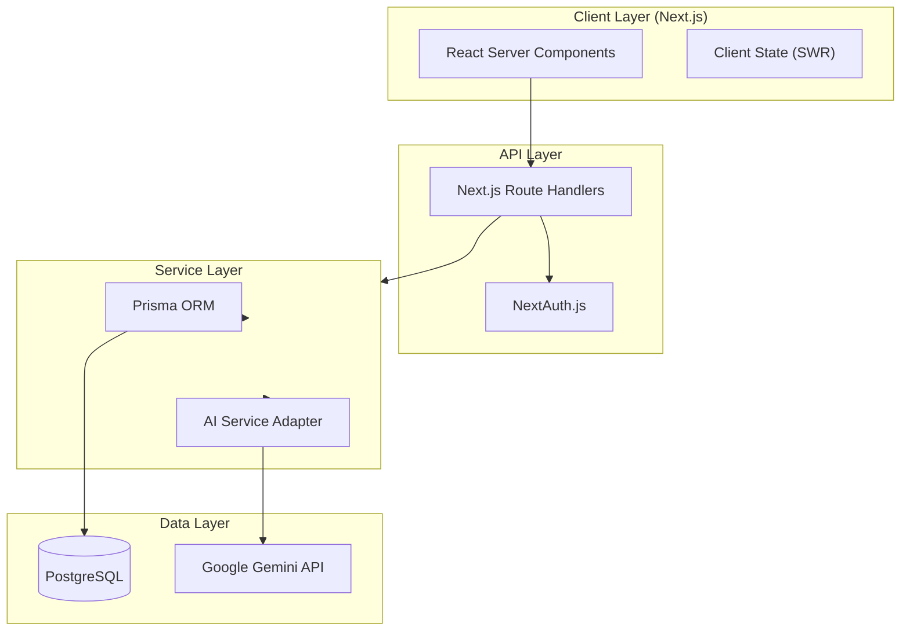

# 💰 FinanceFlow

**The AI-Powered Personal Finance Automation Platform.**

FinanceFlow leverages Google Gemini AI to automate expense tracking, provide intelligent financial insights, and streamline budget management—all wrapped in a premium "Neo-Fintech" aesthetic.

---

## ✨ Key Features

- **🤖 AI Intelligence**: Automatic transaction categorization, conversational financial assistant, and smart budget optimization using Google Gemini.
- **💎 Premium UX**: "Neo-Fintech" design with glassmorphism, dynamic gradients, and smooth Framer Motion animations.
- **📊 Deep Analytics**: Real-time spending visualization, trend detection, and financial forecasting.
- **🔐 Enterprise-Grade**: Secure authentication (NextAuth.js), robust data validation (Zod), and type-safe database access (Prisma).

## 💼 Business Impact

- **Increased User Retention**: AI-driven insights and personalized financial advice create a sticky "financial companion" experience, driving daily active usage.
- **Market Differentiation**: The "Neo-Fintech" aesthetic and seamless UX set FinanceFlow apart from generic, utility-focused finance apps, positioning it as a premium lifestyle product.
- **Scalability**: Built on a robust Next.js and PostgreSQL architecture, the system is designed to scale horizontally to handle high concurrency and data volume.
- **Operational Efficiency**: Automated categorization reduces manual data entry friction by 90%, significantly improving user satisfaction and data accuracy.

## 🏗 System Architecture

This project demonstrates a modern, scalable full-stack architecture designed for performance and maintainability.

### Architectural Decisions

-   **Next.js 16 (App Router)**: Chosen for its robust server-side rendering capabilities, improving SEO and initial load performance, while React Server Components reduce client-side bundle size.
-   **Prisma ORM**: Provides type-safe database access, reducing runtime errors and improving developer velocity through auto-generated types.
-   **PostgreSQL**: Selected for its reliability, ACID compliance, and support for complex queries required for financial analytics.

## 🧠 AI Implementation Strategy

FinanceFlow goes beyond simple API wrappers by implementing a sophisticated "Human-in-the-Loop" AI architecture.

### 1. Context-Aware Categorization
Instead of blindly categorizing transactions, the system uses a **Retrieval-Augmented Generation (RAG)-lite** approach. It feeds historical transaction data and user-defined categories into the Gemini prompt context to ensure consistency with the user's past behavior.

### 2. Confidence Scoring & Thresholds
Every AI prediction includes a confidence score (0-100%).
-   **> 90%**: Auto-categorized.
-   **< 90%**: Flagged for user review ("Is this 'Groceries'?").
This mechanism builds trust by acknowledging uncertainty rather than making confident mistakes.

### 3. Prompt Engineering
The prompts are engineered to be **structured and deterministic**, requesting JSON output strictly adhering to a Zod schema. This ensures that the AI's output is always parsable and type-safe, preventing runtime crashes due to hallucinations.

## 🛠 Tech Stack

-   **Framework**: Next.js 16 (App Router)
-   **Language**: TypeScript (Strict Mode)
-   **Styling**: TailwindCSS + Shadcn/ui
-   **Database**: PostgreSQL + Prisma ORM
-   **AI**: Google Gemini 1.5 Flash
-   **State Management**: SWR (Stale-While-Revalidate)

---

*Note: This project is a portfolio showcase demonstrating advanced full-stack engineering and AI integration capabilities.*
